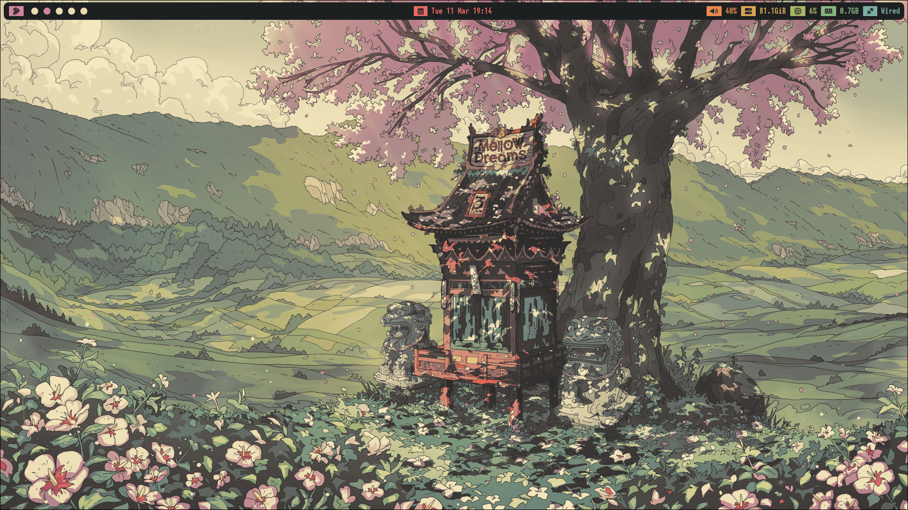
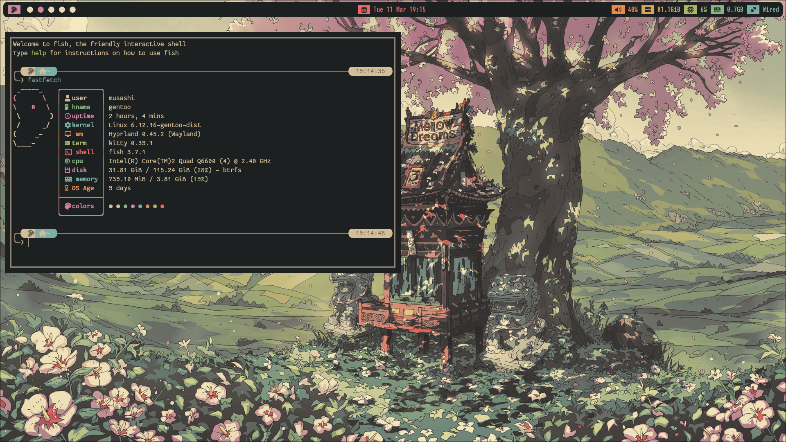
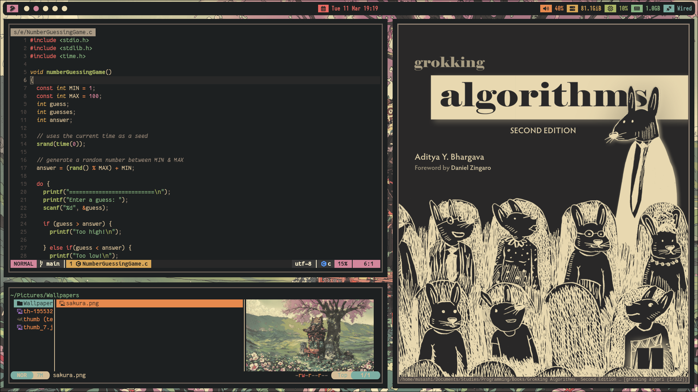
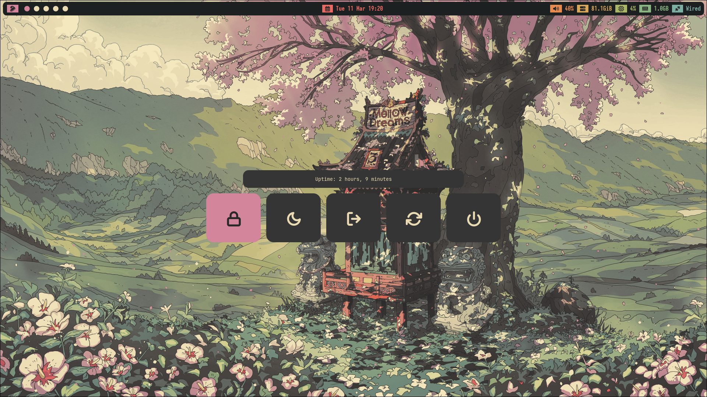

# yurimds10 Dotfiles

<!---Esses são exemplos. Veja https://shields.io para outras pessoas ou para personalizar este conjunto de escudos. Você pode querer incluir dependências, status do projeto e informações de licença aqui--->


#### Desktop


#### Terminal


#### Window Layout


#### Powermenu



> Linha adicional de texto informativo sobre o que o projeto faz. Sua introdução deve ter cerca de 2 ou 3 linhas. Não exagere, as pessoas não vão ler.

|--------------+-----------------------------|
| Linux Kernel | My kernel config            |
| Hyprland     | A Tillling Window Manager   |
| Waybar       | Bar for wayland compositors |
|--------------+-----------------------------|


|-------------------+----------------------------------------------------|
| Linux Kernel      | My custom kernel config                            |
| [[https://github.com/hyprwm/Hyprland][Hyprland]]          | Tiling window manager.                             |
| [Neovim[]]          | My default IDE                                     |
| Firefox           | My browser                                |
| Telegram desktop  | [[https://github.com/indev29/telegram-gruvbox][Gruvbox themes]]                                     |
| Kitty             | My main terminal                                  |
| Musikcube         | Music player ([[https://github.com/Khaustoff/musikcube-gruvbox-themes][three my custom themes]]).             |
| Waybar            | My bar
| Cava              | Audio visualizer (default with my terminal theme)  |
| Yazi              | File manager (one my custom theme).                |
| Zathura           | Pdf viewer                                         |
|-------------------+----------------------------------------------------|


### Ajustes e melhorias

O projeto ainda está em desenvolvimento e as próximas atualizações serão voltadas nas seguintes tarefas:

- [x] Tarefa 1
- [x] Tarefa 2
- [x] Tarefa 3
- [ ] Tarefa 4
- [ ] Tarefa 5

## 💻 Requirements

Antes de começar, verifique se você atendeu aos seguintes requisitos:
<!---Estes são apenas requisitos de exemplo. Adicionar, duplicar ou remover conforme necessário--->
* Você instalou a versão mais recente de `<linguagem / dependência / requeridos>`
* Você tem uma máquina `<Windows / Linux / Mac>`. Indique qual sistema operacional é compatível / não compatível.
* Você leu `<guia / link / documentação_relacionada_ao_projeto>`.

## 🚀 Installing dotfiles

Para instalar o <nome_do_projeto>, siga estas etapas:

Clone this repo:
```bash
git clone https://github.com/yurimds10/dotfiles
```

## 📝 Licença

Esse projeto está sob licença. Veja o arquivo [LICENÇA](LICENSE.md) para mais detalhes.

[⬆ Voltar ao topo](#nome-do-projeto)
